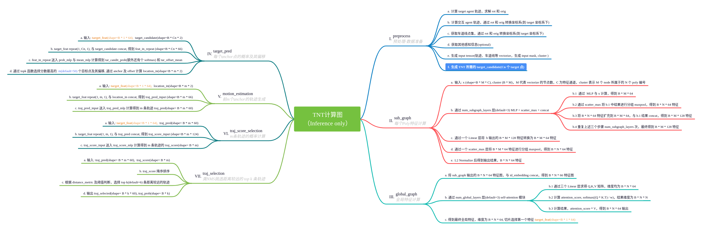
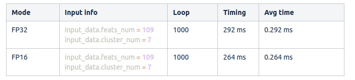

# A Pytorch Re-Implementation of TNT & VectorNet on Custom dataset with TensorRT deploy

Paper:

> [TNT: Target-driveN Trajectory Prediction](https://arxiv.org/abs/2008.08294)

> [VectorNet: Encoding HD Maps and Agent Dynamics from Vectorized Representation](https://arxiv.org/abs/2005.04259)

Thanks to this [TNT implemention](https://github.com/Henry1iu/TNT-Trajectory-Prediction)

## I. Features

Contain follow features:

- [x] my custom data feature preprocessor
- [x] remove torch-geometric requirements
- [x] batchify the data and compute subgraph in pipeline
- [x] better visualize the evaluation result
- [x] use tensorboard to visualize the loss & metric
- [x] simplify the inference pipeline for deploy
- [x] add output log during training
- [x] deploy through TensorRT and libtorch

## II. Train & Test

### 1. Add python path

```
export PYTHONPATH="${PYTHONPATH}:$(pwd)"
```

### 2. Train

```
python tools/train_vectornet.py -d ./mini_data -b 128 --lr 0.005
or
python tools/train_tnt.py -d ./mini_data -b 128 --lr 0.005
```

### 3. Test

```
python tools/test_vectornet.py -d ./mini_data -b 128 -rm weights/best_vectornet.pth
or
python tools/test_tnt.py -d ./mini_data -b 128 -rm weights/best_tnt.pth
```

## III. Plot

> **ATTENTION**: My custom dataset does not have HDMap, so I only use the perception lane for input. This is only for experiment !!!


## IV.Tensorboard


## V. Metric

On my private dataset, the metrics are:

```
{
    'minADE': 0.6467818400568369,
    'minFDE': 1.3008982805719813,
    'MR': 0.20051413881748073,
    'p-minADE': 2.153652389728194,
    'p-minFDE': 2.807768830243343,
    'p-MR': 0.7725899742930608,
    'brier-minADE': 1.1959656446840874,
    'brier-minFDE': 1.8500820851992275
}
```

## VI. Deploy

### 1. Compute graph

Organize the inference computing pipeline as follows:



### 2. TRT deploy

Details can be found in tensorrt_deploy directory.

- Speed Test

VectorNet speed:


> **Libtorch are ABANDONED, please refer to TRT deploy!!!**

### ~~3. Libtorch deploy~~

> ~~Only test on libtorch-cpu(version must > 1.12.0), average 0.4 ms/forward.~~

~~a. Export jit traced module.~~

> ~~python assets/tools/export/vectornet_export_v2.py~~

~~b. Compile cpp code.~~

> ~~cd assets/tools/export/cpp_libtorch~~ > ~~mkdir build && cd build~~ > ~~cmake ..~~ > ~~make~~

~~c. Excute~~

> ~~./vectornet ../../models/traced_vectornet.pt~~
