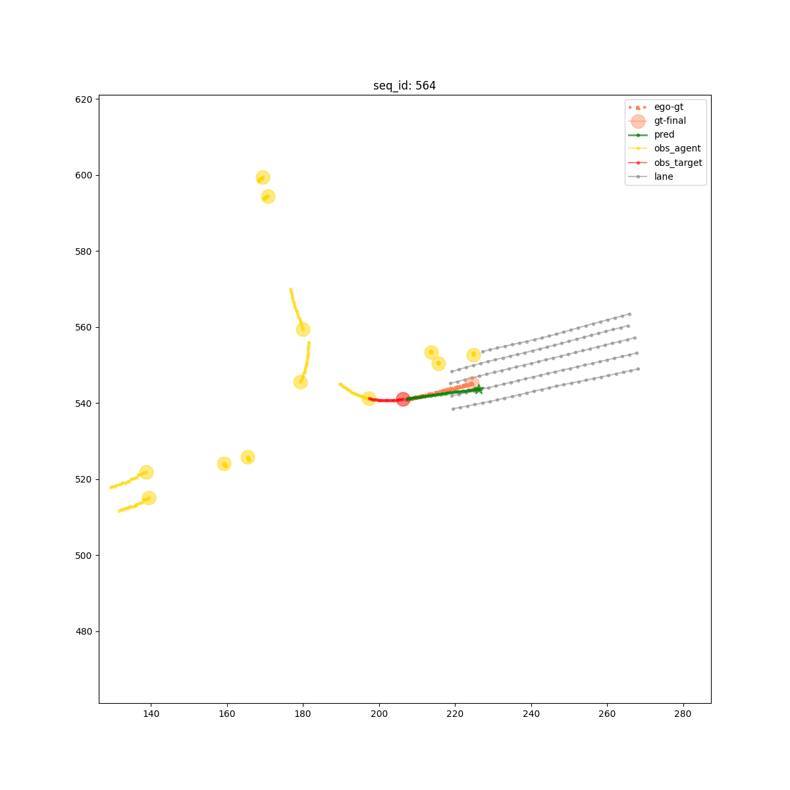
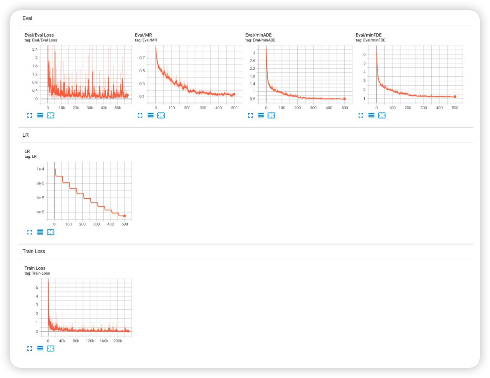
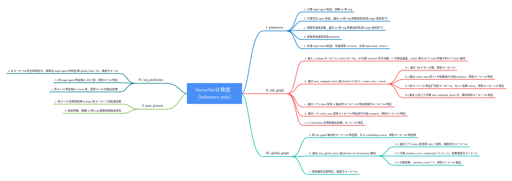

# Reimplement VectorNet on Custom dataset

Paper: [VectorNet: Encoding HD Maps and Agent Dynamics from Vectorized Representation](https://arxiv.org/abs/2005.04259)

Migrate from the [TNT implemention](https://github.com/Henry1iu/TNT-Trajectory-Prediction)

## I. Features

Contain follow features:

- [x] my custom data feature preprocessor
- [x] remove torch-geometric requirements
- [x] batchify the data and compute subgraph in pipeline
- [x] better visualize the evaluation result
- [x] use tensorboard to viz the loss & metric
- [x] overfit the tiny sample dataset
- [x] simplify the inference pipeline for deploy
- [x] export onnx by replace scatter_max with fake_op
- [ ] deploy through TensorRT or other framework

## II. Train & Test

### 1. Add python path

```
export PYTHONPATH="${PYTHONPATH}:$(pwd)"
```

### 2. Train

```
python tools/train_vectornet.py -d ./mini_data -b 128 --lr 0.005
```

### 3. Test

```
python tools/test_vectornet.py -d ./mini_data -b 128 -rm work_dir/best_VectorNet.pth
```

## III. Plot

- Warning: My custom dataset does not have HDMap, so I only use the perception lane for input. This is only for experiment !!!



## IV.Tensorboard



## V. Metric

On my private dataset, the metrics are:

```
{"minADE": 0.3962065457291247, "minFDE": 0.9303791035665404, "MR": 0.11696658097686376}
```

## VI. Deploy

### 1. Compute graph

Organize the inference computing pipeline as follows:


### 2. Libtorch deploy

a. Export jit traced module.

```
python tools/export/vectornet_export_v2.py
```

b. Compile cpp code.

```
cd tools/export/cpp_libtorch
mkdir build && cd build
cmake ..
make
```

c. Excute

```
./vectornet ../../models/traced_vectornet.pt
```

- Attention: Only test on libtorch-cpu(version must > 1.12.0), average 0.4 ms/forward.

### 3. TRT deploy
